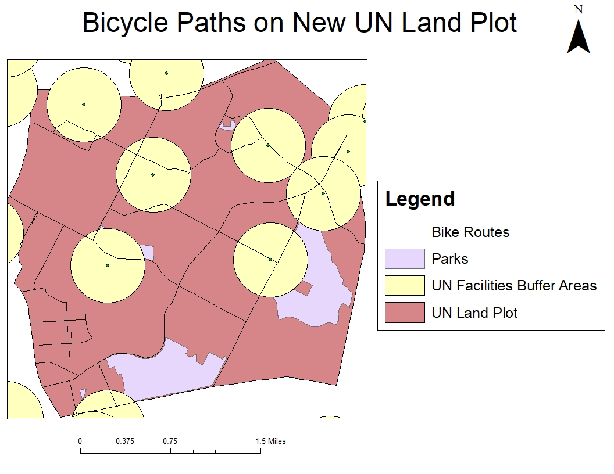

# Lab 2: Geoprocessing Using ArcPy

The purpose of this lab is to create a suitability map in order to display what bike routes and other environmental features cross through a plot of land that belongs to the UN would contain. The lab uses ArcMap 10.8 in order to clip and buffer shapefiles to create the suitability map. In addition, Python is used to code these commands, as shown in lab2_code.py. 

The inputs for this lab were shapefiles of parks, bike routes, facilities, etc. and the output is a suitability map showing areas within the zip shapefile, which is the UN Plot of Land that are impacted by the other aspects such as bike routes that may get in the way, facility buffers. The repository contains code in lab2_code.py that takes the facilties shapefile and creates a 500m buffer around it, clips the areas that are suitable and helpful to the potential planners on the plot of UN land.

Map of Bicycle Paths on UN Land:

